# Hey there 👋

  
  

---

### 🚀 What I Do
- 🎮 Game development (Unity / Unreal)
- 🤖 Automation & AI integration
- 💡 Mixing creativity with tech

---

### 🛠 Tech & Tools
**Languages:** Python · Java · C# · JavaScript  
**Focus Areas:** Game Dev · Automation · AI  

---

## 📫 Connect with Me

  

---

*“Code is like humor. When you have to explain it, it’s bad.” – Cory House*
